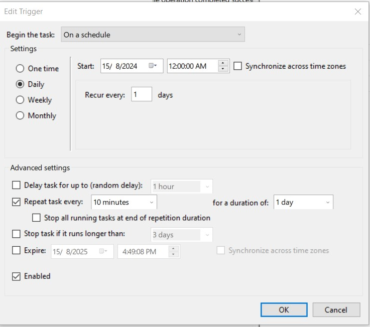
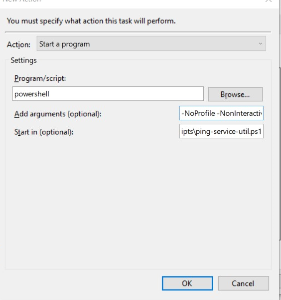

scripts in order to set-up infra and util jobs for Twitter application

Here is how you can set up your own job using Window Powershell and Task Scheduler:
1. Open Task scheduler via search window:  
2. Click on Create task to add new task:
3. Navigate to Trigger item, then configure the scheduler task as below:

4. Continue navigating to Action item, make sure you have the correct path point to where you put this script file. Please use those following args: -NoProfile -NonInteractive -File ".\ping-service-util.ps1" 
